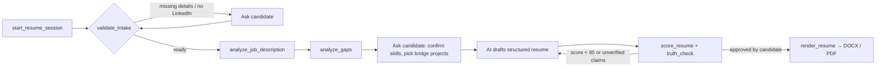

# ResumeForge MCP

**An open-source connector that turns any AI assistant into a resume engine tailored to each job description and built to pass ATS screens.**

Works with Claude, ChatGPT, Cursor, VS Code Copilot, Windsurf, Gemini CLI, Codex, and any other client that supports the [Model Context Protocol](https://modelcontextprotocol.io). No API keys, and it's stateless: nothing about the candidate is stored.

Built primarily for **software engineering and technical roles**, and it handles **any job description** (marketing, finance, ops, healthcare, design…).

```
Original resume vs. Senior Backend Engineer JD   →  56/100 (C)  "Borderline, likely filtered by ATS"
After ResumeForge (no fabricated claims)         →  88/100 (A)  "Strong match"
```
<sub>Real output from the bundled example in [`examples/`](examples/). Run `npm test` to reproduce it.</sub>

---

## Why this exists

Getting past the first screen is the hardest part of a job search. Most resumes are rejected by keyword-ranking ATS systems or a 7-second recruiter skim, before a human ever judges whether the candidate could do the job. Meanwhile, much of what a JD asks for can be learned and demonstrated in days.

ResumeForge closes that gap **aggressively but truthfully**:

| Most "AI resume" tools | ResumeForge |
|---|---|
| Stuff keywords everywhere | Weights keywords by *where* the JD puts them (title > requirements > responsibilities > nice-to-have) and caps repetition |
| Invent experience to match | Maps every JD focus point to the candidate's **real evidence**, then rewrites it in the JD's language |
| Leave gaps as gaps | Turns each gap into a strategy: **surface** (it's on LinkedIn), **reframe** (adjacent tool), **ask**, **bridge project** (build it this week), or **quick-learn** |
| Generic "build a todo app" advice | **Bridge projects themed to the company's domain** (a Go+Kafka *payments* pipeline for a fintech JD), with a day-by-day plan and bullet templates |
| Ignore LinkedIn | **Requires the LinkedIn profile** before drafting and cross-checks titles, companies and dates (recruiters open it right after the resume) |
| Pretty but unparseable PDFs | Single-column DOCX + text-based PDF that Workday, Greenhouse, Lever, iCIMS and Taleo parse cleanly |

> **The one rule:** the resume should be the strongest *true* version of the candidate. A resume that gets the interview but falls apart in it wastes everyone's time. The tool enforces this with a `truth_check` that flags any claim not traceable to the resume, LinkedIn, the candidate's answers, or a bridge project.

---

## How it works



The AI you're already using does the writing. ResumeForge supplies the **deterministic parts**: JD decoding, weighting, gap strategy, evidence mapping, ATS scoring, integrity checks and file rendering. That keeps results consistent across models.

### Tools

| Tool | What it does |
|---|---|
| `start_resume_session` | Returns the playbook, the intake checklist, and ATS rules. The AI calls this first. |
| `validate_intake` | **Hard gate.** Requires name, email, phone, location, a LinkedIn `/in/` URL, and the current resume. Cross-checks resume ↔ LinkedIn (roles, dates, name), finds skills that are on LinkedIn but missing from the resume, and estimates years of experience and career stage. |
| `analyze_job_description` | Weighted keywords (must-have / nice-to-have / contextual) with the exact **ATS phrasing to mirror** (`Amazon Web Services (AWS)`), ranked **focus points**, seniority, years, education, certifications, domain terms, verbs to mirror, and *implied* expectations. |
| `analyze_gaps` | A strategy per gap, an evidence map from each focus point to the candidate's best lines, bridge projects, a resume plan (headline, section order for student / new grad / career switcher / senior), and batched questions for the candidate. |
| `suggest_bridge_projects` | Company-themed projects across 14 archetypes (backend API, event-driven, cloud/IaC, frontend, LLM/RAG, data pipeline, ML to production, mobile, SRE, security, test automation, systems, OSS, business case), each with stack, build plan, bullet templates and talking points. |
| `score_resume` | 0–100 ATS simulation: weighted keyword match (45), keywords backed by bullets (10), title alignment (8), bullet quality (15), structure (10), length (5), integrity (7). Returns blockers, top fixes, and a **truth_check**. Also scores plain text, which is useful for before/after. |
| `render_resume` | Requires `candidate_approved: true` and a valid LinkedIn URL, and refuses unfilled `[N]` placeholders. Outputs **DOCX, PDF (auto-fit to 1 page), Markdown, TXT**, plus LinkedIn alignment suggestions and the final score. |

Also exposed: the prompt `tailor_resume` and the resources `resumeforge://guide/playbook` and `resumeforge://guide/ats-rules`.

---

## Install

Requires **Node.js 20+**.

> The first launch takes about a minute while `npx` downloads and builds the connector from GitHub. After that it starts instantly.
>
> **Troubleshooting:** if your app reports `spawn npx ENOENT` (common with nvm or Volta, because desktop apps don't load your shell's PATH), replace `"npx"` with the full path from `which npx`. Or clone the repo, run `npm install`, and use `"command": "<output of which node>"` with `"args": ["/absolute/path/to/resumeforge-mcp/dist/index.js"]`.

<details open>
<summary><b>Claude Desktop</b></summary>

Settings → Developer → Edit Config (`claude_desktop_config.json`):

```json
{
  "mcpServers": {
    "resumeforge": { "command": "npx", "args": ["-y", "github:Vishu-ak/resumeforge-mcp"] }
  }
}
```
</details>

<details>
<summary><b>Claude Code</b></summary>

```bash
claude mcp add resumeforge -- npx -y github:Vishu-ak/resumeforge-mcp
```
</details>

<details>
<summary><b>Cursor</b> (<code>~/.cursor/mcp.json</code>) · <b>Windsurf</b> (<code>~/.codeium/windsurf/mcp_config.json</code>) · <b>Gemini CLI</b> (<code>~/.gemini/settings.json</code>)</summary>

```json
{
  "mcpServers": {
    "resumeforge": { "command": "npx", "args": ["-y", "github:Vishu-ak/resumeforge-mcp"] }
  }
}
```
</details>

<details>
<summary><b>VS Code (GitHub Copilot agent mode)</b> (<code>.vscode/mcp.json</code>)</summary>

```json
{
  "servers": {
    "resumeforge": { "type": "stdio", "command": "npx", "args": ["-y", "github:Vishu-ak/resumeforge-mcp"] }
  }
}
```
</details>

<details>
<summary><b>OpenAI Codex CLI</b> (<code>~/.codex/config.toml</code>)</summary>

```toml
[mcp_servers.resumeforge]
command = "npx"
args = ["-y", "github:Vishu-ak/resumeforge-mcp"]
```
</details>

<details>
<summary><b>ChatGPT / claude.ai (web and mobile), via a remote connector</b></summary>

Web apps need a hosted HTTPS endpoint.

**One click (free tier):** [](https://render.com/deploy?repo=https://github.com/Vishu-ak/resumeforge-mcp)

**Or run the prebuilt image anywhere** (Railway, Fly.io, Cloud Run, a VPS…). Every push to `main` publishes it:

```bash
docker run -p 3333:3333 ghcr.io/vishu-ak/resumeforge-mcp:latest
# MCP endpoint: https://<your-host>/mcp   health check: /health
```

- **claude.ai:** Settings → Connectors → *Add custom connector* → paste `https://<your-host>/mcp`.
- **ChatGPT:** enable *Developer mode* under Settings → Connectors / Apps, then create a connector with `https://<your-host>/mcp`.

In remote mode, files come back inline (as embedded PDF/DOCX resources) and nothing is written to the server's disk. Set `RESUMEFORGE_API_KEY` to require a bearer token (for clients that support custom headers), and `RESUMEFORGE_ALLOWED_ORIGINS` to restrict CORS.
</details>

<details>
<summary><b>No connector support at all?</b></summary>

Use [`prompts/universal-prompt.md`](prompts/universal-prompt.md) as a Custom GPT / Gem / Project instruction, or paste it into any chat. It carries the same method (intake gate, JD weighting, gap strategies, bridge projects, scoring rubric, truth check) for the AI to follow by hand.
</details>

---

## Use it

Just ask your AI:

> *"Tailor my resume for this job"* (and paste the JD)

The connector's instructions make the AI start the session, collect your details and LinkedIn, and walk through the flow. You'll be asked for:

1. Name, email, phone, location
2. **LinkedIn URL and profile content.** Paste it, or use LinkedIn → *More* → *Save to PDF*.
3. Your current resume
4. The job description
5. *(Optional)* GitHub, side projects, courses, anything not on your resume yet

Files are saved to `~/ResumeForge/` (change with `RESUMEFORGE_OUTPUT_DIR`) as `Firstname_Lastname_Company_Role_Resume.docx/.pdf`.

---

## Example: what the connector sees

Input: [`examples/sample-jd.txt`](examples/sample-jd.txt) (Senior Backend Engineer, payments), [`sample-resume.txt`](examples/sample-resume.txt), [`sample-linkedin.txt`](examples/sample-linkedin.txt).

**`analyze_gaps` (excerpt)**

```text
Go            must_have  surface (learning)  "Your LinkedIn says you're learning Go. A bridge project in Go
                                              turns 'learning' into a shipped, listable skill."
Apache Kafka  must_have  reframe             "You have RabbitMQ, which transfers directly…"
PostgreSQL    must_have  surface             "Already on your LinkedIn but missing from the resume."
gRPC          must_have  bridge_project
Terraform     nice_to_have quick_learn       "~8–20 hours to working proficiency"

Bridge project → "Event-Driven Payments Processing Pipeline"
  stack: Apache Kafka, Go, Kubernetes, gRPC, …   closes: Kafka, Go, gRPC, Concurrency, Observability…
  Day 1: Define the payment event schemas and run the broker locally…
```

**Evidence map:** the focus point *"Experience with Docker, Kubernetes and CI/CD pipelines"* is matched to the candidate's real line *"Created Jenkins pipelines for automated build and deployment to AWS EC2"*, which becomes the bullet to rewrite.

**Result:** [`examples/sample-tailored-resume.json`](examples/sample-tailored-resume.json) scores **88/100** with **zero unverified claims**. The Go/Kafka project renders as *"(In Progress)"* until it's built. Rendered output: [`examples/sample-output.pdf`](examples/sample-output.pdf).

---

## Privacy

- **Stateless.** No database, no sessions, no telemetry. The HTTP server creates a fresh instance per request.
- In local (stdio) mode, everything runs on your machine; files are written only to your output folder.
- The server never fetches LinkedIn (scraping violates LinkedIn's terms and is blocked anyway). You paste your own profile.

---

## Development

```bash
npm install
npm test            # 35 tests: skills, JD parsing, intake, gaps, scoring, rendering, MCP end-to-end
npm run dev         # stdio server via tsx
npm run dev:http    # HTTP server on :3333
npm run inspect     # open the MCP Inspector against the built server
```

**Releasing:** push a tag like `v0.1.1` (matching `package.json`). The Release workflow tests the code, publishes to npm (requires an `NPM_TOKEN` repo secret), and pushes a versioned Docker image to GHCR.

Project layout:

```
src/
  server.ts          MCP tools, prompts, resources
  index.ts           CLI: stdio (default) or --http
  schemas.ts         Candidate profile + Resume schema (with evidence sources)
  workflow.ts        The playbook the AI follows
  core/              jd · intake · gap · bridge · score · skills · dates · resumeParse · resumeText
  data/              skills taxonomy (320+ skills, 570+ aliases) · action verbs · bridge-project archetypes
  render/            docx · pdf (auto-fit) · markdown/txt
prompts/universal-prompt.md   for AIs without MCP
examples/                     sample JD, resume, LinkedIn, tailored output
```

## Contributing

The biggest quality levers are **data**: skill aliases, domain themes, bridge-project archetypes, and non-tech role coverage. See [CONTRIBUTING.md](CONTRIBUTING.md).

## License

MIT
